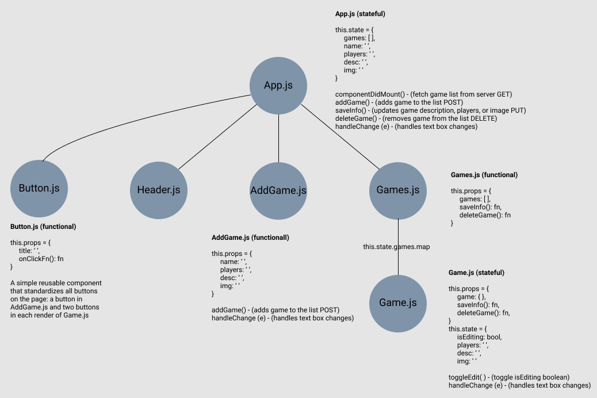
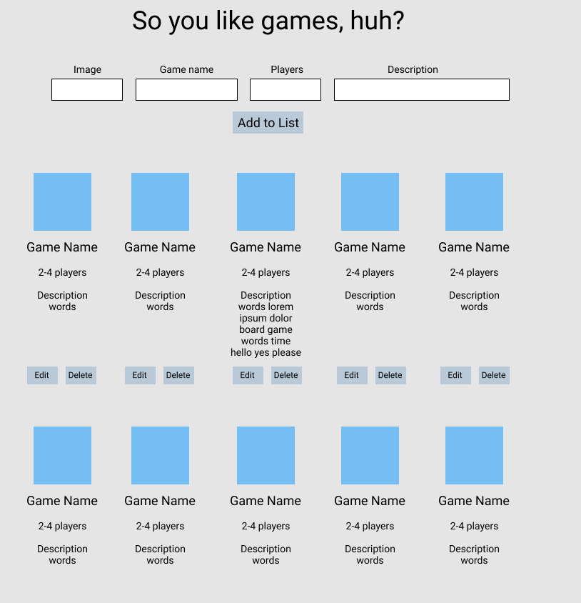

# Tabletop Game Tracker App

## Application Concept and Wireframe
### Application Concept
- This is a simple list app to keep track of board games and recommendations.
- There is no API and just a simple, empty JSON, which will be added to by the user.
- Full CRUD
    - GET: view the current list of board games
    - POST: add a new board game to the collection
    - PUT: Change the rating or description of the game
    - DELETE: remove the game from the collection

### Functionality
- We want a header at the top of the page to display the name of our app
- 

### Endpoints
- GET - fetch the current list of board games
- POST - add a new title and details to the list
- PUT - edit the rating or description of a game
- DELETE - delete a title from the list

### Component Architecture
- **App.js** (stateful: holds our game list information, this.state.games)
    - **Header.js** (functional)
    - **AddGames.js** (stateful: axios POST request at top to add user-inputted data to the JSON)
    - **Games.js** (functional: passing down props and mapping over the Game.js component to show our list of games)
        - **Game.js** (stateful: this.state.desc, this.state.players, this.state.img, this.state.isEditing)

### Diagrams

